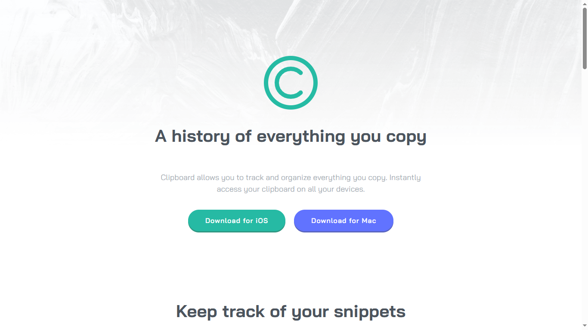

# Frontend Mentor - clipboard-landing-page-master

Project built as a solution to the "clipboard" challenge on Frontend Mentor.

---

## 📸 Screenshot

---

## 🔗 Links

- Solution URL: https://github.com/johnstone14/A-solution-to-the-clipboard-challenge-on-Frontend-Mentor.
- Live Site URL: https://johnstone14.github.io/A-solution-to-the-clipboard-challenge-on-Frontend-Mentor./

---

## 🛠️ Built with

- Semantic HTML5
- CSS custom properties (variables)
- Flexbox
- Media queries (responsive)
- Mobile-first workflow
- CSS positioning (`position`, `transform`)

---

## 🚀 Features

- Responsive layout for mobile and desktop
- Interactive share button with toggle popup for social media links
- Smooth hover effects on buttons and interactive elements
- Clean, modern UI with semantic HTML5 structure
- Mobile-first workflow for optimal performance

---

## 🧩 Project structure

- `index.html`
- `styles/` (folder with CSS files: global.css, header.css, etc.)
- `assets/design/` (reference design images)
- `assets/images/` (icons, images, favicon)

---

## 👤 Author

- Frontend Mentor - https://www.frontendmentor.io/profile/johnstone14#
